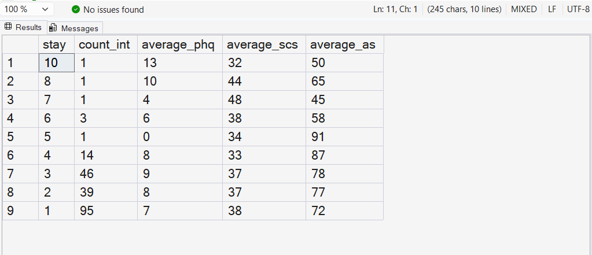

# Student Mental Health SQL Analysis

## Project Overview

This project analyzes mental health data for international students using SQL Server.

The analysis focuses on the relationship between the length of stay and several mental health indicators among international students.

## Dataset

The dataset contains student information, including:

- Student type: international or domestic
- Region
- Gender
- Academic level
- Length of stay
- Depression score
- Social connectedness score
- Acculturative stress score

## Tools Used

- SQL Server Management Studio
- T-SQL
- CSV dataset
- GitHub

## Main Question

How does the length of stay affect mental health scores among international students?

## SQL Analysis

The query groups international students by their length of stay and calculates:

- Number of international students
- Average depression score
- Average social connectedness score
- Average acculturative stress score

## Query

```sql
SELECT TOP 9
    stay, 
    COUNT(inter_dom) AS count_int,
    ROUND(AVG(todep), 2) AS average_phq, 
    ROUND(AVG(tosc), 2) AS average_scs, 
    ROUND(AVG(toas), 2) AS average_as
FROM students
WHERE inter_dom = 'Inter'
GROUP BY stay
ORDER BY stay DESC;
```

## Results

Although the query uses `TOP 9`, the result returns 5 rows because the dataset contains only 5 grouped stay values for international students.

The results show the average depression score, social connectedness score, and acculturative stress score grouped by length of stay.

## Query Result



## Files

- `students.csv`: The dataset used in the analysis
- `schema.sql`: SQL script used to create the `students` table
- `analysis.sql`: SQL query used for the analysis
- `screenshots/`: Folder containing the query result screenshot

## How to Run

1. Create a database in SQL Server.
2. Run `schema.sql` to create the `students` table.
3. Import `students.csv` into the `students` table.
4. Run `analysis.sql` in SQL Server Management Studio.
5. View the results in the Results window.

## Key Insights

The analysis helps compare mental health indicators across different lengths of stay for international students.

It can be used to explore whether students who stay longer experience different levels of depression, social connectedness, or acculturative stress.


## Author

Omar Naguib
